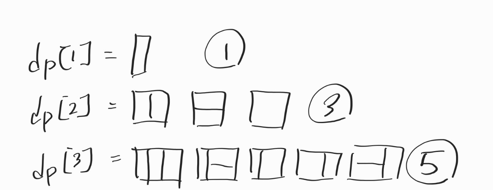
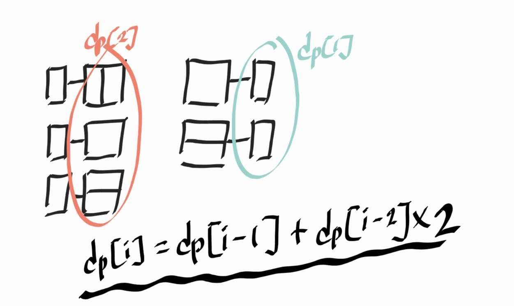

# 0. 문제 링크

[>>[BOJ] 11726번: 2xn 타일링<<](https://www.acmicpc.net/problem/11726)

# 1. 문제 풀이

이런 도형 문제는 그려보는 편이다.   

2x1(세로) 1x2(가로) 2x2(네모) 3개의 도형이 있다.

dp[i] 는 가로로 i칸이 있음을 의미한다.



그러면 dp[3]을 만들기 위해 또 두 가지로 나눌 수 있다.   

하나는 dp[2] 경우의 수에 2x1 도형을 붙이고 있는 것 과   
다른 하나는 dp[1] 경우의 수에 1x2를 2개 붙인 것과 2x2 1개 붙인 것 이다.

그렇게 되면 점화식은 아래의 그림과 같아진다.



# 2. 전체 풀이

```
package BOJ;

import java.io.*;

public class BOJ_11727 {
	public static void main(String[] args) throws IOException {
		BufferedReader br = new BufferedReader(new InputStreamReader(System.in));
		BufferedWriter bw = new BufferedWriter(new OutputStreamWriter(System.out));

		int n = Integer.parseInt(br.readLine());

		int[] dp = new int[n + 1];

		dp[1] = 1;
		if (n < 2) {
			bw.write(dp[n] + "");
		} else {
			dp[2] = 3;

			for (int i = 3; i <= n; i++) {
				dp[i] = (dp[i - 1] + dp[i - 2] * 2) % 10007;
			}

			bw.write(dp[n] + "");
		}

		bw.flush();
		bw.close();
		br.close();
	}
}
```