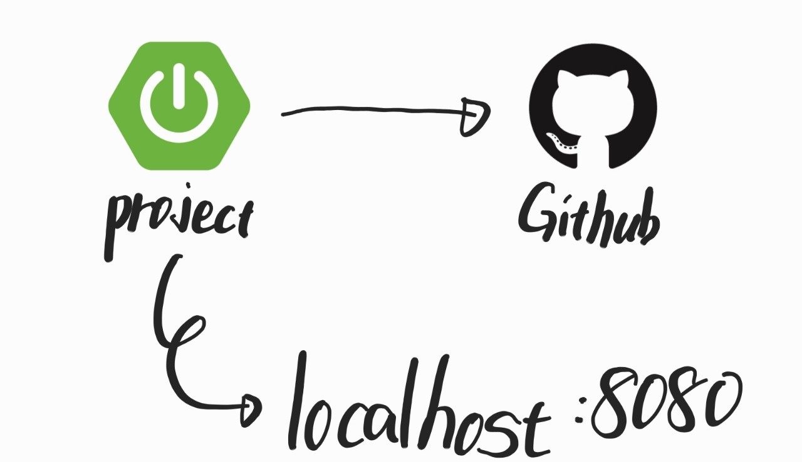
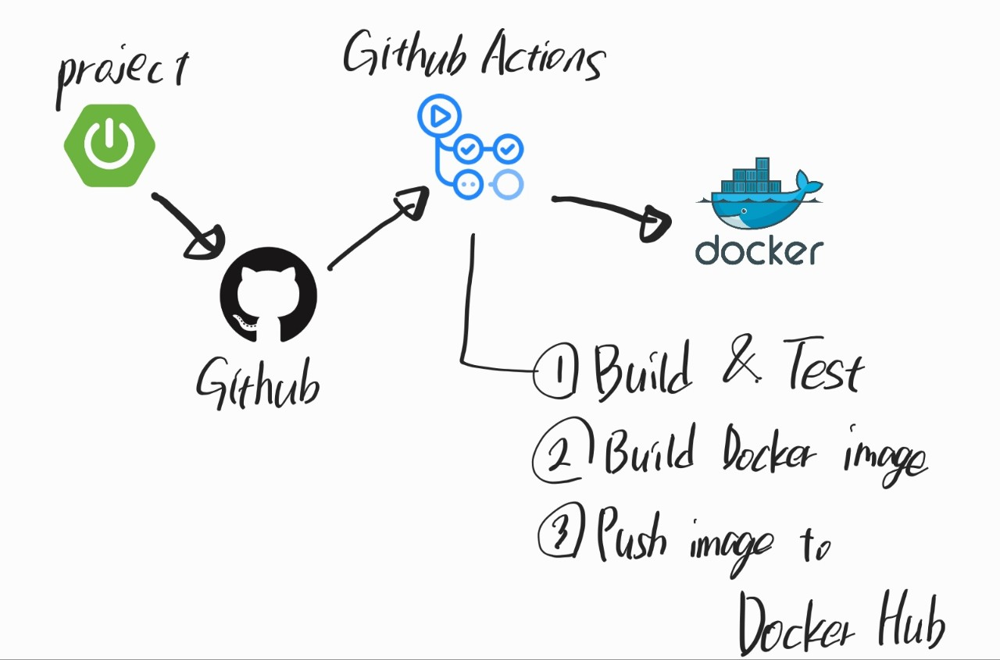
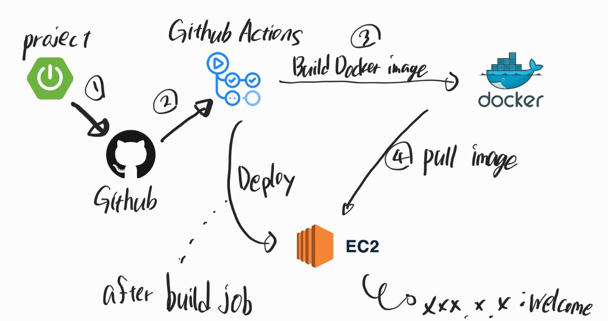

# 0. 서론
평소에는 누군가가 나에게 CI/CD를 아냐고 물으면 대답은 "뭔진 알아요" 라고 대답했다.

당장 CI/CD의 스펠링을 말하라고 하면 "Code Integration, Code Deploy?" 라고 생각하고 있으니 반은 맞췄다고 해야하나 모르겠다. 사실 '코드 통합 / 코드 배포'라고 해도 "코드를 통합? 코드를 배포? 배포는 호스팅 한다는 건가?" 라고 부끄러울 정도로 알고있었다.

다행인 것은 이번 스터디에서 CI/CD의 주제에 대해 나름대로 이론과 실습을 진행하기로 하였다. 

추후에 글을 업데이트 해나가겠지만 현재 작성하고 있는 시기는 아직 실습을 해보기 이전, 개념과 기본적인 실습 과정에 대해 알아본 것을 정리하기 위해 작성중이다. 그럼 본격적으로 작성해 보겠다.

&nbsp;

&nbsp;

# 1. CI/CD의 뜻
먼저 뜻부터 알아본다.

+ `Continuous Integration` : 지속적 통합

+ `Continuous Delivery / Continuous Deploy` : 지속적 제공 / 지속적 배포

먼저 지속적 '통합' 이란 말이 직관적이지 않다. 쉽게 이해하기 위해 Merge라고도 할 수 있지 않을까.

이해를 돕기위해 극단적으로 예시를 들어보겠다.
1. 회사에서 당신에게 회원가입 할 때 필요한 비밀번호 입력에 특수문자도 받도록 수정하라는 업무를 맡았다.
2. 금요일 밤 야근을 하며 야무지게 코드를 작성하였다.
3. 당신의 사수가 "그정도 간단한 업무는 리뷰 받지 말고 바로 올려~" 라고 지시를 받았다.
4. 야무지게 코드를 올리고 배포까지 수작업으로 마무리했다.
5. 퇴근 후, 침대에 누워서 자려고 하는데 아뿔싸! 테스트 코드를 실행하지 않고 배포를 한 것이었다!
6. 결국 홈페이지는 다운되어 있고 사용자 정보가 누출되는 대형사고를 치고 말았다.

과거에는 'Merge Day' 라는 날이 있었듯이 모든 팀원들이 모여 Merge를 하고 잘 동작하는지 테스트 하는 날이 있었다. 5명의 코드를 전부 merge하고 테스트 하면 되지 않냐 라고 하기에는 오류가 났을 때, 누구의 코드에서 오류가 발생했는지 알수 없었다. 따라서 한명 merge 하고 테스트 하고, 한명 merge 하고 테스트 하고를 반복했다. 시간이 너무 낭비된다.

이러한 일련의 과정과 실수를 대비하고 효율적으로 해결하기 위해 탄생한 것이 CI/CD 인 것이다.

&nbsp;

&nbsp;
# 2. CI/CD의 Workflow

아래의 그림이 가장 많이 보았을 형태이다. 로컬에서 run을 하고 코드를 github에 저장한다.

&nbsp;

&nbsp;

다음의 그림이 본격적인 CI이다.

정확히는 Docker Hub로 보내는 과정은 Continuous Delivery 이다.

Github에 코드를 올리면 Github Actions이 사전에 지정한 Workflow대로 동작을 수행한다.

앞서 설명한 대로 Github Actions는 사전에 지정한 Workflow를 기반으로 동작한다.

기본적인 흐름은 배포를 하기위한 형태로 Build를 하고 단위 테스트를 진행한다.

모든 테스트가 정상적으로 동작된 것을 확인하면 이를 별도의 저장소로 이동시키거나 Docker image의 형태로 Build하여 Docker Hub에 저장한다. Docker Hub에 저장되어 있는 이미지를 Pull 하여 cmd 창으로 코드를 실행 할 수 있다. 여기까지 왔으면 감이 어느정도 잡힐 것이다.

&nbsp;

&nbsp;

여러 최종 형태의 일종이고 내가 해볼 실습의 형태이다.

Github Actions의 Workflow에 Deploy도 정의할 수 있다.

3번의 과정이 정상 동작된 것이 확인 되면 Deploy 과정을 실행한다.

Github Actions에서 AWS EC2로 신호를 보내고 EC2에서 신호를 받으면 연결된 Docker Hub로 부터 pull을 받아 EC2 환경에서 변경된 코드로 Run을 실행한다.

이를 통해 팀원들의 코드를 다같이 모여서 Merge할 필요 없이 코드를 올리면 정의된 Workflow에 따라 오류가 없으면 배포까지 이루어지고 오류가 발생하면 즉시 모든 Workflow를 중단하기 때문에 안전하다.

대략적인 이론을 알아보았고 실습을 진행할 차례이다.

이후 기록할 만한 중간 결과가 나온다면 추가할 것이다.

https://www.youtube.com/watch?v=YLtlz88zrLg

https://www.youtube.com/watch?v=SKILL1pT6f4

https://www.youtube.com/watch?v=KTHZyV9yJGY